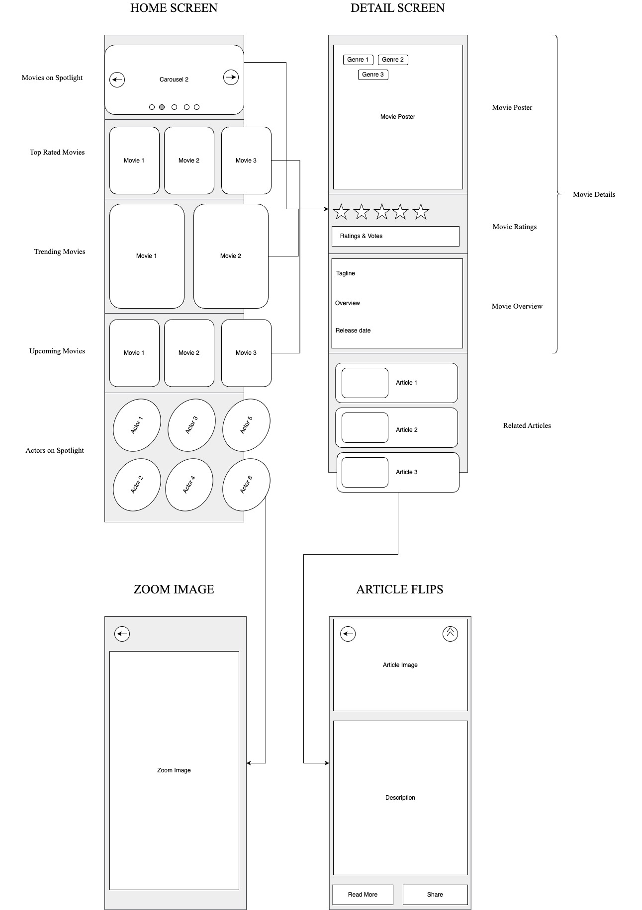

# Cineworld

An android mobile application to get latest updates about Cinema across the world.
<br>The app is using a publicly available movies related APIs to display its data and features.

## Features
Some of the main features of the app includes,

1. Movies on Spotlight
2. Top rated movies
3. Trending movies World wide
4. Upcoming Movies
5. Actors on Spotlight
6. Movie Details
7. Related Articles

## Screen Designs & Wireframes
The main app screens includes,
- Home Screen
- Detail Screen
- Zoom Image
- Article Flips

`Home screen` shows all the list of movies and actors according to their respective categories
<br>whereas `Details screen` shows the more details and articles related to the selected movie.

`Zoom Image` uses a third party library for displaying and zooming in the selected images
<br> whereas `Article Flips` View show the articles in a short flipping page format.



## Video Demo
[](https://www.youtube.com/watch?v=K6ZBg12dNVE)

## Screenshots


## Code Design & Structure
The code is designed by following the SOLID principles and MVVM design pattern to maintain a clean code architecture. Code separation is maintained using modular approach by creating multiple modules and packages for corresponding features or purpose.

To avoid deep coupling between codes, dependency injection is used, which is Dagger 2 Hilt. Data bindings and view bindings are implemented as well to ease the connection between views and data.

Retrofit is used for fetching the API Network data response. The data flow from the network to the UI is structured through repository and view models before it reaches the UI. The UI component (Activity/Fragment) will be observing the live data in the view model and update the UI accordingly by following the MVVM Architecture.

In short the code structure have,
```
Activity based screen designs

View Binding

Data Binding

Hilt Dependency Injection

Coroutines

Repository data flow

Retrofit Network API

View Model & Live data

MVVM design pattern

SOLID principles with clean code architecture

Support Modules (Modular Approach)
```


## Public APIs Used
### The Movie Data Base (TMDB)
The Movie Data Base (TMDB) has a wide range of collections in cinema related APIs and this website will provide a wide range of public APIs with Authorization. The APIs involved in the Cineworld application are listed below,

> Movies on Spotlight
<br>https://api.themoviedb.org/3/movie/now_playing

> Top rated Movies
<br>https://api.themoviedb.org/3/movie/top_rated

> Trending Movies
<br>https://api.themoviedb.org/3/movie/popular

> Upcoming Movies
<br>https://api.themoviedb.org/3/movie/upcoming

> Artists on Spotlight
<br>https://api.themoviedb.org/3/person/popular

> Movie Details
<br>https://api.themoviedb.org/3/movie/{id}

> Related Articles
<br>https://api.themoviedb.org/3/search/multi?query={search_query}

```
Note : The APIs are protected with access tokens and hence it won’t load without token.
We need to pass the bearer token as Authorization in the header.
```